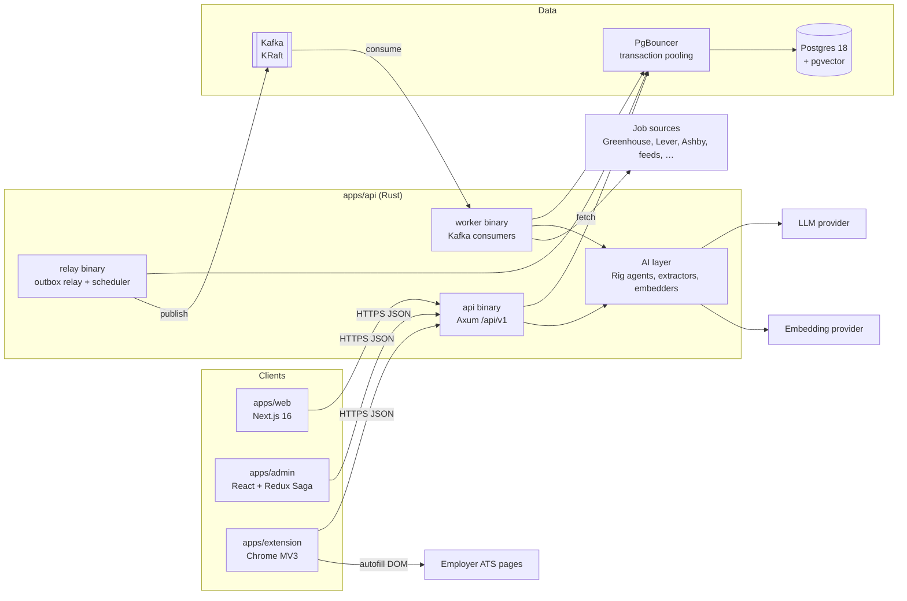
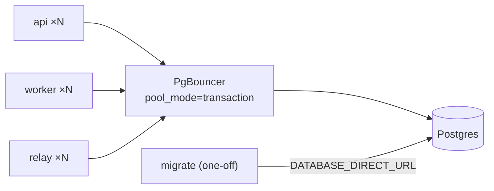
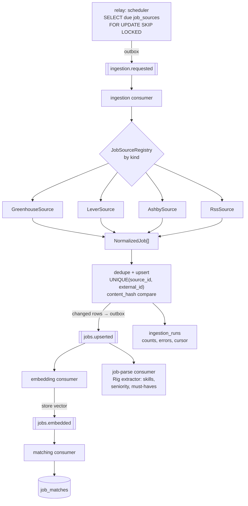
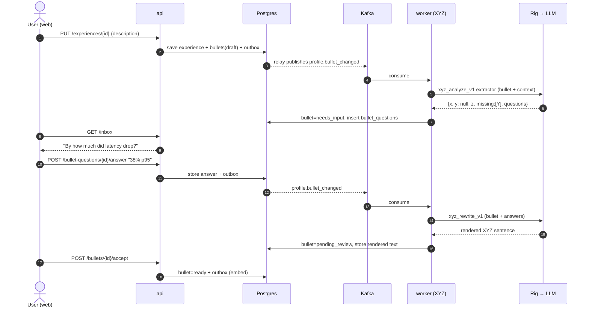
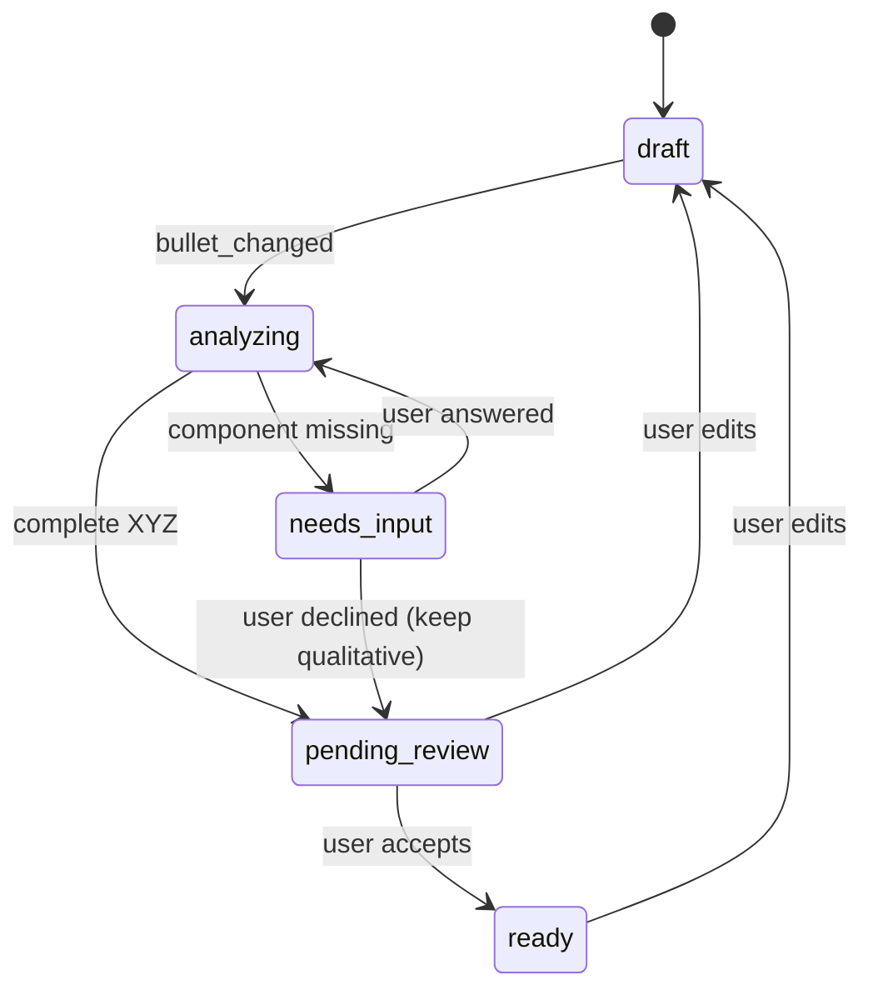
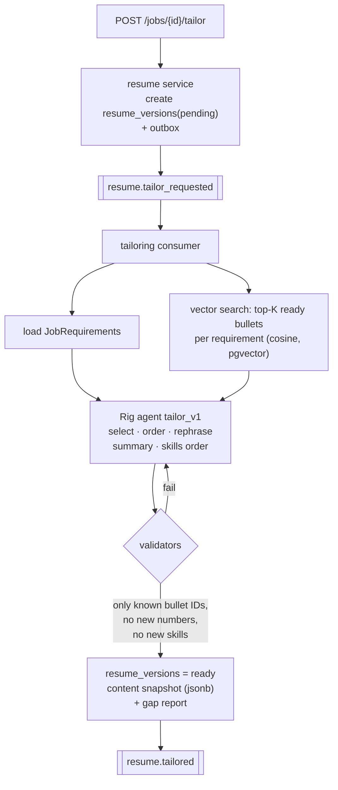
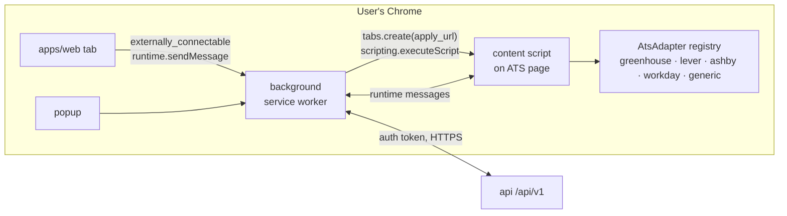
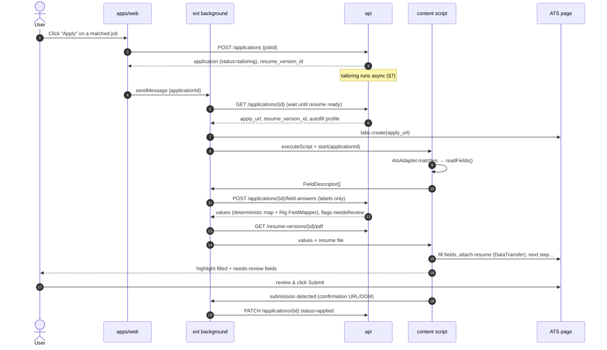
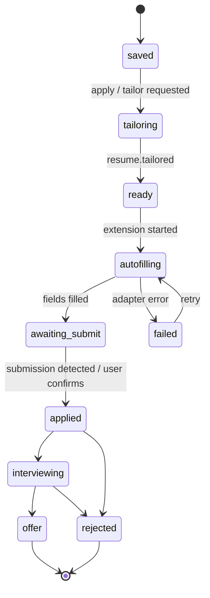
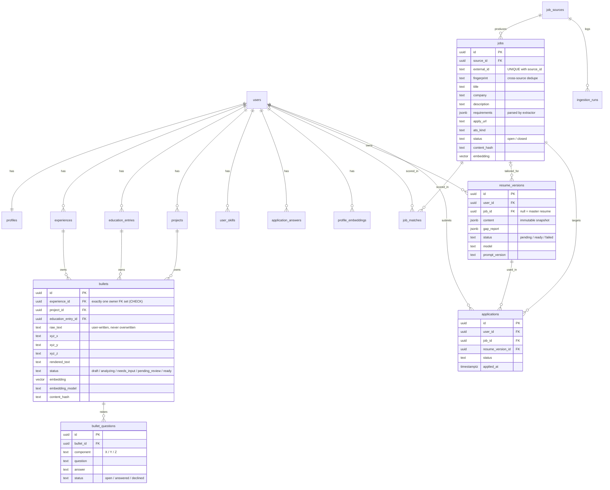

# System Design: Product & Architecture Plan

> Status: **planning**. This document describes the target system. Sections marked _Open decision_ still need a call before implementation.
> For where code lives, see [coding-standards.md](./coding-standards.md#project-structure). For the current local setup, see [infrastructure.md](./infrastructure.md).

## 1. Product overview

Apply Pilot is an AI job-application assistant, similar to Job AI Assist. It:

1. **Aggregates jobs** from many sources through pluggable adapters, normalizes them, and embeds them for semantic matching.
2. **Holds a structured career profile**: experience, education, skills, projects, summary, certifications, and links. Each item is stored relationally **and** as embeddings.
3. **Turns raw accomplishments into Google XYZ bullets** ("Accomplished **X**, as measured by **Y**, by doing **Z**"). When a component is missing (usually the metric **Y**), the AI asks the user for it instead of inventing it.
4. **Tailors a resume per job** by selecting, ordering, and lightly rephrasing the user's verified bullets against the job description.
5. **Applies through the browser extension**: it opens the job's application page in the user's own browser, fills the form with the tailored resume and profile data, and leaves final submission to the user.
6. **Tracks applications** from saved → applied → interviewing → offer/rejected.

### Users and surfaces

| Surface | Who | Purpose |
| --- | --- | --- |
| `apps/web` | Job seeker | Profile editor, XYZ question inbox, job feed, tailored resumes, application tracker |
| `apps/extension` | Job seeker | Capture a job from any page, autofill application forms, report submission |
| `apps/admin` | Operator | Manage job sources, watch ingestion runs, inspect and replay dead-lettered events, monitor LLM usage |
| `apps/api` | — | HTTP API, Kafka workers, AI layer (Rig), outbox relay, ingestion scheduler |

### Guiding principles

- **Truthfulness over polish.** The AI never fabricates metrics, employers, dates, or skills. Missing facts become questions to the user.
- **User stays in control.** The extension fills forms but **never clicks the final submit**. Every AI-generated answer is reviewable.
- **Async by default for slow work.** Embedding, LLM analysis, tailoring, and ingestion run on Kafka-driven workers. The HTTP API stays fast.
- **Postgres is the source of truth.** Kafka carries events and work; it never holds the only copy of data.
- **Respect source terms.** Ingest jobs through public/official APIs and feeds. Don't scrape sites whose terms forbid it.

## 2. High-level architecture



### Runtime processes

All three binaries are built from the single `apps/api` crate (`src/lib.rs` + `src/main.rs` + `src/bin/*`), so they share domain code, Diesel models, and event types.

| Process | Responsibility | Scales by |
| --- | --- | --- |
| `api` | HTTP endpoints, auth, short synchronous AI calls (e.g. mapping one unknown form field) | Replicas behind a load balancer |
| `worker` | Kafka consumer groups: ingestion, embedding, XYZ analysis, tailoring, matching | Replicas, bounded by partition count per topic |
| `relay` | Polls `outbox_events` and publishes to Kafka; enqueues due ingestion runs | 1–2 replicas (row locking with `SKIP LOCKED` makes multiple safe) |
| `migrate` (one-off) | `diesel migration run` against the **direct** Postgres URL before a deploy rolls out | — |

Today the API runs migrations on boot. That stays fine for local dev; in multi-replica deployments migrations move to the one-off `migrate` step so replicas don't race.

## 3. Data platform

### 3.1 Postgres + pgvector

- Image: `pgvector/pgvector:pg18`, replacing `postgres:18-alpine`. A migration runs `CREATE EXTENSION IF NOT EXISTS vector;`.
- Rust: the `pgvector` crate with the `diesel` feature supplies the `Vector` type and the distance operators in the query DSL (`cosine_distance`, `l2_distance`, `max_inner_product`). Map the SQL type in `diesel.toml` (`import_types`) so `print-schema` emits `pgvector::sql_types::Vector`.
- Index: HNSW with `vector_cosine_ops` on every embedding column that's searched (`jobs.embedding`, `bullets.embedding`, `profile_embeddings.embedding`).
- Primary keys: UUID v7 (time-ordered, index-friendly, safe to expose in URLs).
- Every embedding row stores `embedding_model` and `content_hash`:
  - if `content_hash` is unchanged, the content isn't re-embedded (saves cost);
  - changing the model means a new migration (a new dimension needs a new column) plus a backfill event per row. Old and new vectors are never compared.

_Open decision:_ the embedding model, and with it the vector dimension (e.g. 1024 or 1536). It's fixed per column.

### 3.2 PgBouncer

Every application process connects through PgBouncer; only the `migrate` step connects directly.



Rules that follow from transaction pooling:
- PgBouncer **≥ 1.21** with `max_prepared_statements` > 0, because `diesel-async` (tokio-postgres) uses protocol-level prepared statements.
- No session state: no `SET` without `LOCAL`, no session advisory locks, no `LISTEN/NOTIFY`, no temp tables across transactions. Coordination uses row locks (`FOR UPDATE SKIP LOCKED`) inside a transaction instead.
- The app-side `bb8` pool stays small per process. PgBouncer is the real multiplexer, sized against Postgres `max_connections`.
- Env: `DATABASE_URL` (via PgBouncer) for apps, `DATABASE_DIRECT_URL` for migrations and the Diesel CLI.

### 3.3 Kafka

Kafka is the work queue and event bus. The Rust client is `rdkafka` (librdkafka, built statically with the `cmake-build` feature so the runtime image needs no extra system libraries). Locally, a single broker runs in KRaft mode (no ZooKeeper).

**Reliability model:**

1. **Transactional outbox.** A service writes its state change **and** an `outbox_events` row in the same Diesel transaction. The `relay` publishes pending rows to Kafka and marks them sent. A crash between commit and publish therefore can't lose the event.
2. **At-least-once delivery.** Producers use `enable.idempotence=true`, `acks=all`. Consumers commit offsets **after** the handler succeeds.
3. **Idempotent consumers.** Every event carries an `event_id`. Handlers either perform naturally idempotent upserts or record `(consumer, event_id)` in `processed_events` within the same transaction as their write.
4. **Retries and DLQ.** A transient failure retries with backoff via `<topic>.retry`. After N attempts the event goes to `<topic>.dlq`. The admin app lists DLQ events and can replay them.
5. **Ordering.** The partition key is the aggregate whose order matters (`user_id` for profile/resume events, `job_id` for job events).

**Event envelope** (JSON):

```
{ eventId, type, version, occurredAt, key, traceparent, payload }
```
`traceparent` carries the OpenTelemetry context, so a trace runs from HTTP request → outbox → Kafka → worker.

**Topics:**

| Topic | Key | Produced by | Consumed by | Purpose |
| --- | --- | --- | --- | --- |
| `ingestion.requested` | `source_id` | relay (scheduler), admin | ingestion consumer | Run one `JobSource` fetch |
| `jobs.upserted` | `job_id` | ingestion consumer, extension capture | embedding consumer, job-parse consumer | New or changed job content |
| `jobs.embedded` | `job_id` | embedding consumer | matching consumer | Job vector ready; score against users |
| `profile.item_changed` | `user_id` | profile service | embedding consumer | Experience, project, education, skill, or summary changed |
| `profile.bullet_changed` | `user_id` | profile service | XYZ consumer, embedding consumer | Raw or answered bullet needs (re)analysis |
| `profile.embedded` | `user_id` | embedding consumer | matching consumer | Profile vectors refreshed; rescore jobs |
| `resume.tailor_requested` | `user_id` | resume service | tailoring consumer | Build a tailored resume for a job |
| `resume.tailored` | `user_id` | tailoring consumer | notification, application service | Resume ready; applications can proceed |
| `applications.status_changed` | `user_id` | application service | analytics/notifications | Audit trail and notifications |

## 4. Job aggregation (adapter pattern)

### 4.1 Adapter contract

Each source is one implementation of a `JobSource` trait in `apps/api/src/adapters/job_sources/`. Adding a source never touches existing adapters or the pipeline (open/closed).

Contract, described in prose (the code will carry the doc comments):

| Member | Contract |
| --- | --- |
| `kind()` | Stable identifier stored in `job_sources.kind` (`greenhouse`, `lever`, `ashby`, `rss`, `adzuna`, `extension_capture`, …) |
| `fetch(config, cursor)` | Returns a page of `NormalizedJob` plus the next cursor. Respects the source's rate limits. Retryable errors and permanent errors are distinct types. |
| `NormalizedJob` | `external_id` (stable per source), title, company, location(s), remote type, employment type, description (HTML stripped to clean text + original HTML), salary range if present, `posted_at`, `job_url`, `apply_url`, detected `ats_kind` |

A `JobSourceRegistry` maps `kind` → adapter instance. It's the only place adapters are listed.

Candidate first adapters, all public job-board APIs or feeds: Greenhouse Job Board API, Lever Postings API, Ashby Job Board API, generic RSS/Atom, and **extension capture** (the user saves the JD they're looking at, so any site works without scraping).

_Open decision:_ which aggregator APIs to add beyond the ATS boards (e.g. Adzuna, Remotive). Each needs its API terms checked.

### 4.2 Ingestion pipeline



- **Dedupe.** Within a source: `UNIQUE (source_id, external_id)`. Across sources (the same posting on two boards): a `fingerprint` of normalized company + title + location groups duplicates into one canonical job shown in the feed.
- **Change detection.** `content_hash` over the normalized text. An unchanged hash means no event, no re-embedding, and no LLM cost.
- **Expiry.** Jobs missing from N consecutive successful runs are marked `closed`. They're never deleted, because applications reference them.
- **Structured parse.** A Rig extractor turns the description into `JobRequirements { must_have_skills, nice_to_have_skills, seniority, years_experience, responsibilities[] }`, stored as `jsonb`. Tailoring and matching use it.

### 4.3 Matching

For each `(user, job)` pair:

```
score = w1 · cosine(profile_vector, job_vector)
      + w2 · skill_overlap(user_skills, job.must_have ∪ nice_to_have)
      + w3 · preference_fit(location, remote, seniority, salary, visa)
```

- Candidate retrieval uses the HNSW index (top-K jobs by cosine distance to the user's profile vector) filtered by hard preferences. The weighted score is computed only for those candidates, never for the full cross product.
- Results go in `job_matches (user_id, job_id, score, reasons jsonb)`. `reasons` explains the match in the UI ("Matches 6/8 must-have skills").

## 5. Career profile & XYZ bullets

### 5.1 What the user stores

| Section | Fields (abridged) |
| --- | --- |
| Profile | name, headline, contact, location, links, work authorization, salary expectations, job preferences |
| Summary | free text (AI can propose a per-job variant) |
| Experience | company, title, location, start/end, employment type, free-text description |
| Education | institution, degree, field, dates, GPA (optional), coursework, honours |
| Projects | name, role, dates, URL, tech stack, description |
| Skills | name, category (language/framework/tool/soft), proficiency, years |
| Certifications, languages, awards | standard fields |
| Application answers | reusable answers to common form questions (notice period, relocation, sponsorship, "why us" templates) |

Experience, project, and education entries own **bullets**: the atomic accomplishments that end up on a resume.

### 5.2 Google XYZ format

> Accomplished **[X]** as measured by **[Y]**, by doing **[Z]**.

- **X**: the accomplishment or outcome
- **Y**: the measurable result (a number, %, time, money, scale, or verifiable qualitative fact)
- **Z**: the action or method (skills, tools, approach)

Example: "Reduced checkout latency **(X)** by 38% at p95 **(Y)** by moving pricing lookups to a Redis read-through cache **(Z)**."

### 5.3 Enrichment flow

1. **Extract.** When the user saves an experience, project, or education description, a Rig extractor splits the free text into candidate bullets. The user confirms or edits them.
2. **Analyze.** Each bullet goes to the XYZ analyzer (structured output): `{ x, y, z, missing: [X|Y|Z], confidence, questions[] }`.
3. **Ask.** For each missing component, the analyzer writes a **specific** question, e.g. "You said you 'improved the onboarding flow'. By how much did activation or completion change, and over what period?" Questions appear in the web app's **Inbox**.
4. **Rewrite.** When the user answers, the bullet is re-analyzed with the answer as authoritative input, and a final XYZ sentence is rendered.
5. **Accept.** The user approves the rendered bullet, which becomes `ready`. Only `ready` bullets are used for tailoring.





**Guardrails:**
- The raw text the user wrote is kept forever (`raw_text`); AI output is stored alongside it, never over it.
- **No invented numbers.** A deterministic validator rejects any rendered bullet containing a number that doesn't appear in the raw text or the user's answers. A rejection is treated as an analyzer failure and retried with a stricter prompt.
- If the user can't supply a metric, they can decline. The bullet then keeps a qualitative Y ("adopted by three product teams") or none.

## 6. AI layer (Rig)

All LLM and embedding work runs in Rust through [Rig](https://github.com/0xPlaygrounds/rig) (`rig-core`), under `apps/api/src/ai/`.

| Rig building block | Used for |
| --- | --- |
| Completion provider client | LLM calls; the provider is chosen in config and not hard-coded in services |
| `Extractor<T>` (structured output into a `JsonSchema` type) | Bullet extraction, XYZ analysis, job-requirement parsing, form-field mapping |
| `Agent` with preamble + context | Resume tailoring, summary rewrite, free-text application answers |
| `EmbeddingModel` | Embedding jobs, bullets, and profile sections |

**Design rules:**
- Domain services depend on small traits (`Embedder`, `BulletAnalyzer`, `ResumeTailor`, `FieldMapper`). The Rig-backed implementations live in `ai/`, and tests use fakes. This keeps Rig and provider changes out of domain code.
- Vector storage and search stay in **Diesel + pgvector**, not in a Rig vector-store integration. That keeps one database access path and the no-raw-SQL rule.
- Prompts live in `ai/prompts/` as versioned templates (`xyz_analyze_v1`). Every AI output row records `model`, `prompt_version`, and token usage, so results are reproducible and costs can be audited.
- **Untrusted input.** Job descriptions and ATS page content are third-party text. They're passed to the model as clearly delimited data, never as instructions, and model output is validated against the expected schema before use.
- Per-user token budgets and per-provider rate limits are enforced in the AI layer.
- Never send more PII than the task needs. Form-field mapping, for example, sends field labels and the relevant profile keys, not the whole profile.

_Open decision:_ the LLM provider and model for generation (default suggestion: Claude Sonnet via Rig's Anthropic provider; a cheaper model for high-volume extraction) and the embedding provider (Anthropic doesn't offer embeddings, so use another Rig-supported provider or a local model via Ollama).

## 7. Resume tailoring



1. The user (or the apply flow) requests a tailored resume for a job. The API answers **202 Accepted** with a `resume_version_id`; the client polls or subscribes (SSE) for completion.
2. **Retrieve.** For each requirement, pgvector returns the user's most similar `ready` bullets. Skills are matched against `must_have` / `nice_to_have`.
3. **Generate.** The tailoring agent receives the requirements and the candidate bullets **by ID**. It returns a structured resume: chosen bullet IDs per section, order, lightly rephrased text that mirrors JD terminology, a tailored summary, and a skills ordering.
4. **Validate.** Deterministic checks: every bullet references a real ID owned by the user; rephrased text introduces no numbers, employers, or skills absent from the source; dates and titles are copied verbatim, not generated.
5. **Gap report.** Requirements with no supporting evidence are listed for the user ("JD asks for Kubernetes; no bullet mentions it. Add one?"). They're never silently filled.
6. **Persist.** `resume_versions` stores an immutable `content` snapshot. The PDF is **rendered on request** from that snapshot with an ATS-friendly single-column template, so no file storage is needed.

_Open decision:_ the PDF renderer (e.g. Typst as a Rust library vs. HTML → headless Chrome). Typst keeps it in-process and Rust-only.

## 8. Applying via the browser extension

### 8.1 Extension components



- **Background service worker**: holds the auth token, makes every API call, opens and controls tabs. It's the only component that talks to the API.
- **Content script**: runs on the ATS page, reads the form, fills fields, and never sees the token.
- **AtsAdapter** (adapter pattern again, client-side): one per ATS vendor, with `matches(url, document)`, `readFields()` → `FieldDescriptor[]` (label, name, type, options, required, step), `fill(field, value)`, and `nextStep()` for multi-page forms. A `generic` adapter handles unknown sites using labels and `autocomplete` hints.
- **Permissions**: `storage`, `scripting`, `tabs`; `optional_host_permissions` for known ATS domains, requested at runtime the first time a domain is used; `host_permissions` for the API origin; `externally_connectable` for the web app origin.

### 8.2 Apply flow



**Field filling details:**
- **Mapping order:** (1) the adapter's deterministic map for standard fields (name, email, phone, links, work authorization); (2) the user's saved application answers; (3) the AI `FieldMapper` for anything left. Values from step 3 are always marked **needs review**.
- Values are set with the native value setter and `input`/`change` events, so React- and Vue-controlled inputs register them. Files are attached through `DataTransfer` on the file input.
- **Never auto-submit.** CAPTCHAs, legal attestations, and the final click stay with the user.
- Page content is untrusted: only field labels and options are sent to the API, and AI output can only become field values. It can't trigger navigation, clicks, or script.

### 8.3 Application lifecycle



## 9. Data model (core tables)



Support tables not drawn: `outbox_events` (id, topic, key, payload, created_at, published_at), `processed_events` (consumer, event_id), `llm_usage` (user_id, purpose, model, tokens, cost), and auth/session tables.

## 10. API surface (initial)

All routes are relative to `/api/v1` and documented with `utoipa` at `/docs`.

| Area | Endpoints |
| --- | --- |
| Profile | `GET/PUT /profile`, CRUD `/experiences`, `/education`, `/projects`, `/skills`, `/application-answers` |
| Bullets | `GET /bullets?status=`, `PUT /bullets/{id}`, `POST /bullets/{id}/accept` |
| Inbox | `GET /inbox`, `POST /bullet-questions/{id}/answer`, `POST /bullet-questions/{id}/decline` |
| Jobs | `GET /jobs` (feed, filters), `GET /jobs/{id}`, `POST /jobs/capture` (from extension) |
| Matches | `GET /matches` |
| Resumes | `POST /jobs/{id}/tailor` (202), `GET /resume-versions/{id}`, `GET /resume-versions/{id}/pdf` |
| Applications | `POST /applications`, `GET /applications`, `GET /applications/{id}`, `PATCH /applications/{id}`, `POST /applications/{id}/field-answers` |
| Admin | CRUD `/admin/job-sources`, `POST /admin/job-sources/{id}/run`, `GET /admin/ingestion-runs`, `GET /admin/dlq`, `POST /admin/dlq/{id}/replay` |

## 11. Cross-cutting concerns

- **Auth.** Clerk. The web app holds the session (`@clerk/nextjs`). The extension reuses it through Clerk's Sync Host (`@clerk/chrome-extension`), so there's no separate sign-in in the extension. The background worker will get short-lived tokens from `@clerk/chrome-extension/background`. The API will verify Clerk JWTs against the instance JWKS (not built yet).
- **Privacy.** A profile is sensitive PII. Encrypt it in transit and at rest; never log it; offer full export and hard delete (deletes cascade to embeddings and resume versions); document which data each LLM call sends.
- **Observability.** `tracing` + OpenTelemetry. Trace context is propagated through the Kafka envelope. Key metrics: consumer lag per group, DLQ depth, ingestion success rate per source, LLM latency/tokens/cost per purpose, and autofill success rate per ATS adapter.
- **Rate limiting.** Per job source (adapter-declared), per LLM provider, and per user for AI endpoints.
- **Config.** New env vars (`DATABASE_DIRECT_URL`, `KAFKA_BROKERS`, LLM/embedding provider keys and model names) are read only in `config.rs` and added to `.env.example` and [infrastructure.md](./infrastructure.md) when introduced.

## 12. Planned infrastructure changes

None of this exists yet. Each change lands with the phase that needs it.

| Change | Phase |
| --- | --- |
| Postgres image → `pgvector/pgvector:pg18`; migration enabling `vector` | 1 |
| PgBouncer service (transaction mode, `max_prepared_statements`) between apps and Postgres | 1 |
| Kafka (single-broker KRaft) in `docker-compose.yml`; topic bootstrap | 2 |
| `apps/api` gains `lib.rs`, `bin/worker.rs`, `bin/relay.rs`; Dockerfile builds all binaries | 2 |
| Separate `migrate` step in deploys | before first multi-replica deploy |

## 13. Delivery phases

| Phase | Scope | Done when |
| --- | --- | --- |
| 1. Profile foundation | Users/auth, profile CRUD, bullets, pgvector + PgBouncer | User can enter a full profile in `apps/web` |
| 2. Events & AI core | Outbox, relay, Kafka, worker binary, Rig embedder + XYZ analyzer, Inbox | Bullets get analyzed, questions are asked and answered, and `ready` bullets are embedded |
| 3. Job aggregation | `JobSource` trait, 2–3 adapters, scheduler, dedupe, job parsing, matching, admin source management | Feed shows ranked, deduplicated jobs with match reasons |
| 4. Tailoring | Tailoring agent, validators, gap report, PDF rendering | One click produces a validated, tailored PDF for a job |
| 5. Extension apply | Background/content split, `AtsAdapter`s (Greenhouse, Lever first), field mapping, application tracking | Extension fills a Greenhouse/Lever form end to end; user submits; status becomes `applied` |
| 6. Hardening | DLQ replay UI, token budgets, observability dashboards, export/delete | Operators can see and recover every failure mode listed above |

## 14. Open decisions (summary)

1. ~~Auth approach and provider.~~ Clerk (see §11).
2. Embedding model and vector dimension.
3. LLM provider/models per purpose (generation vs. extraction).
4. PDF renderer (Typst vs. headless Chrome).
5. Which aggregator APIs to integrate beyond public ATS job boards.
6. Hosting target (where Kafka, PgBouncer, and Postgres run in production).
